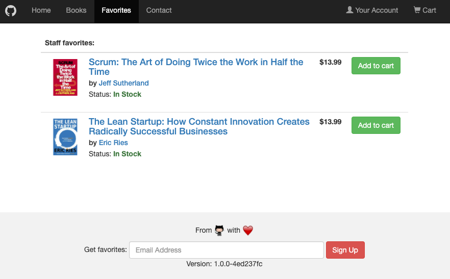

# Development Guide

The bookstore consists of two parts, the web front end which runs from a Java Servlet and a Database persistence layer.

---
* [Components](#components)
  * [Web Application](#web-app)
  * [Database](#database)
* [Development Environment](#development-environment)
  * [Maven](#maven)
  * [GitHub Actions](#github-actions)

---

## Components

### Web App
The web app is a simple servlet that will obtain the books from the database and then render them for the user into HTML using Thymeleaf templates.
The servlet is built into a WAR that can then be deployed to any web server that is capable of supporting servlets.

### Database
To make development and testing easier, if you do not provide the necessary environment varaibles for configuring an external database,
then the web application will set up and provision an in-memory database for you.
This in-memory database will be populated with a sample set of books as defined in [BookUtils.java](../src/main/java/com/github/demo/service/BookUtils.java);

To specify an external database you will need to ensure that a JDBC driver is provided (we currently package in the PostgreSQL driver) via the following environment variables:
* `DATABASE_URL`: The JDBC URL for connecting to the database, e.g.`jdbc:postgresql://<db-server>:<db-port>/<db-name>`
* `DATABASE_USER`: The database user to connect to the database
* `DATABASE_PASSWORD`: The database user password to connect to the database

## Development Environment

To develop on this project you will need an environment that has the following tools and setup:

* Java 11 SDK
* Maven 3.6.3
* Docker client (building containers or spinning up an external database)
* An IDE that supports Java

Optional
* Terraform and Terragrunt
* PostgreSQL database server
* kubectl - for deploying to Kubernetes
* gcloud SDK - for accessing the GKE cluster and accessing Terraform state

__If the amount of software and tooling necessary is a bit daunting, then you can utilize the the GitHub Codespace that is built into this repository. It will provide you with a
comprehensive set of tools and preset configurations to get started with development and debugging.__

### Maven
To make development easy we utilize Maven to build and provide a simple web application container in the form of Jetty to allow you to run up the application.

You can also build a Container image (if you have a Docker client to hand) from the Maven `package` step if running under Linux. It will build a container based on the Jetty official 
image to serve up the WAR file built from the Maven build. Using this you can test locally on your machine.

### GitHub Actions
The repository is configured to build and deploy our software in a Continuous Delivery based approach. Any changes that end up on the defaul `main` branch will get deployed to the `prod`
environment automatically.
